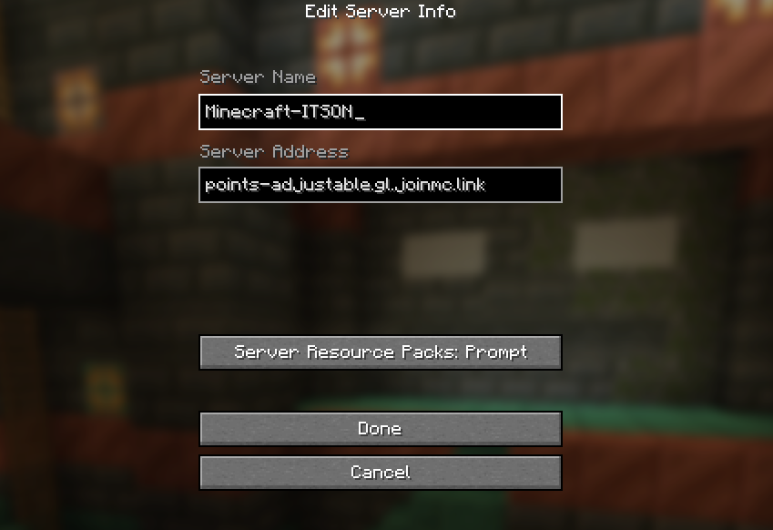

# Bienvenido al Servidor

Este es el servidor oficial de Minecraft para estudiantes de ITSON, el servidor cuenta con distintos mods que permiten una mejor experiencia de juego, agregando nuevos animales, mobs, biomas, jefes y estructuras que por defecto no exiten en Minecraft Vanilla, esperamos que puedas unirte y ser parte del servidor.

## Instalación

Para ingresar al servidor es necesario tener minecraft instalado en tu computadora, puedes usar tanto la versión premium de Minecraft o clientes grautiutos como `TLauncher`, `LauncherFenix`, etc. Además sera necesario instalar los `Mods` del servidor.

## Video (Guia de Instalación)

<video controls src="Instalacion de Mods.mov" title="Title"></video>

## Pasos de Instalación

A continuacion se enlistan los pasos de instalación:

1. Descarga el archivo comprimido que se adjunta a continuación.
    
    https://github.com/mcortezv/Minecraft-ITSON/blob/main/setup.zip

2. Una vez descargado deberas descomprimirlo.

    

    

3. Entra a la carpeta generada y haz doble click en el archivo `neoforge-21.1.141-installer.jar`

    

4. Haz clic en el boton `Proced` y espera a que se instale.

    

5. Una vez terminado presiona el boton de `OK`.

