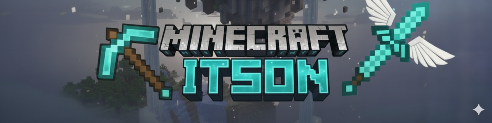
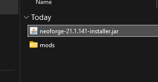
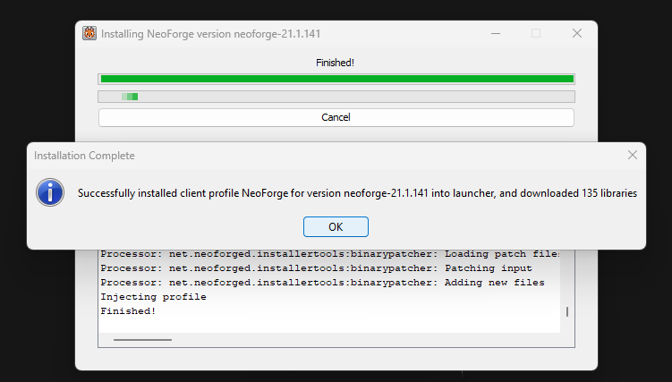
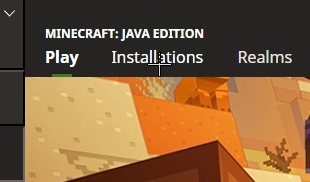
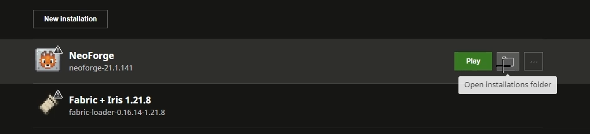
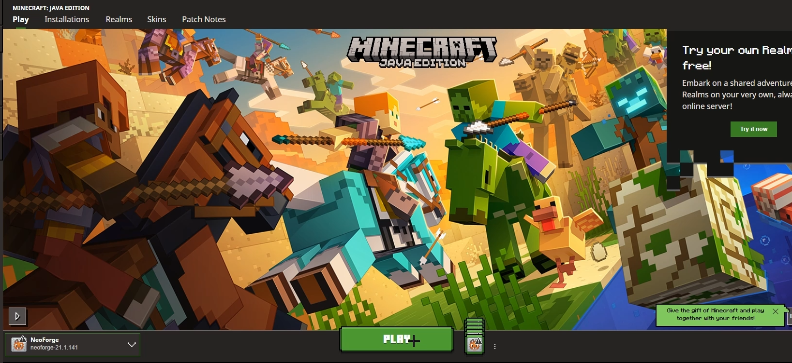
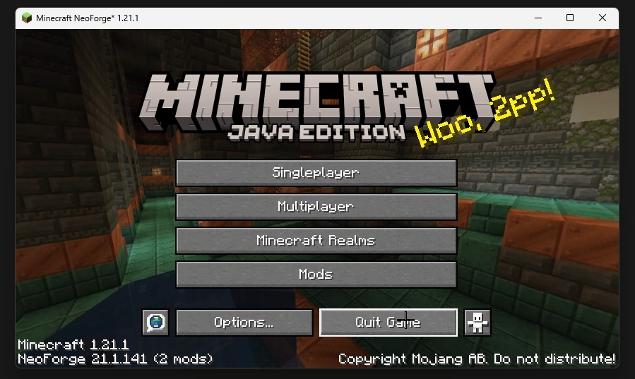
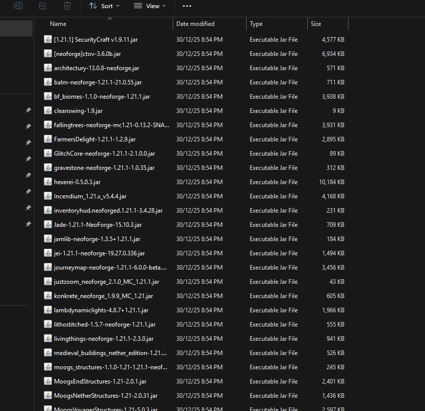
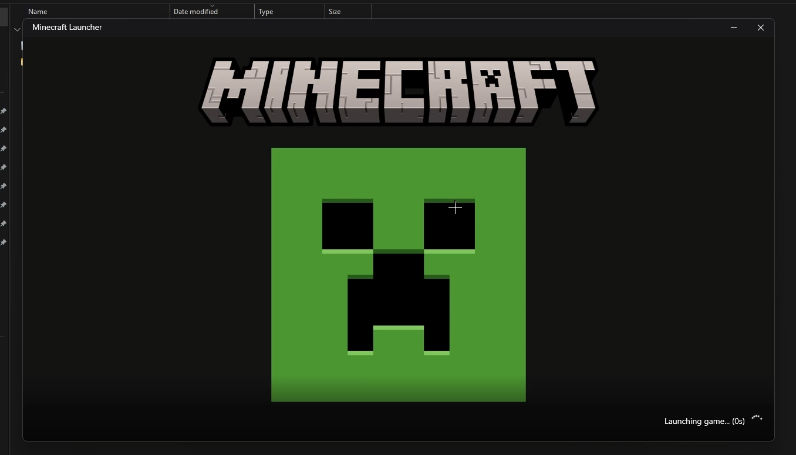

# Bienvenido al Servidor

Este es el servidor oficial de Minecraft para estudiantes de ITSON, el servidor cuenta con distintos mods que permiten una mejor experiencia de juego, agregando nuevos animales, mobs, biomas, jefes y estructuras que por defecto no exiten en Minecraft Vanilla, esperamos que puedas unirte y ser parte del servidor.

## Únete a Discord 
    
   https://discord.gg/9enXHjyJMp

## Instalación

Para ingresar al servidor es necesario tener minecraft instalado en tu computadora, puedes usar tanto la versión premium de Minecraft o clientes gratuitos como `TLauncher`, `LauncherFenix`, etc. Además sera necesario instalar los `Mods` del servidor.

## Video (Guia de Instalación de Mods)

## Pasos de Instalación de Mods

A continuación se enlistan los pasos de instalación:

1. Descarga el archivo comprimido que se adjunta a continuación.
    
    https://github.com/mcortezv/Minecraft-ITSON/blob/main/setup.zip

2. Una vez descargado deberas descomprimirlo.

    

    

3. Entra a la carpeta generada y haz doble click en el archivo `neoforge-21.1.141-installer.jar`

    

4. Haz clic en el botón `Proced` y espera a que se instale.

    

5. Una vez terminado presiona el botón de `OK`.

    

6. Abrir el Launcher de Minecraft.

    

7. Ir a `Instalaciones`.

    

8. Crear la carpeta de la instancia.

    

    

9. Iniciar Minecraft para genera las carpetas necesarias.

    

10. Una vez cargue lo podemos cerrar.

    

11. Entrar nuevamente a la carpeta de la instancia.

    

12. Pegar los `Mods` del archivo descargado en la carpeta de `Mods` de la instacia.

    

    

13. Abrir por última vez Minecraft.

    

14. Abajo a la izquierda debera aparecer la version `1.21.1` y `47 Mods` instalados.

## Link del Servidor

Entra a `Multijugador` en Minecraft, agrega un nuevo servidor y pega la siguiente dirección: 

    window-verbal.gl.joinmc.link

